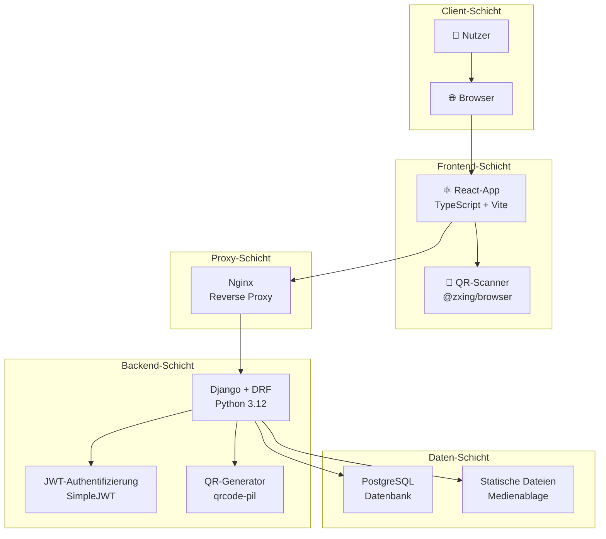
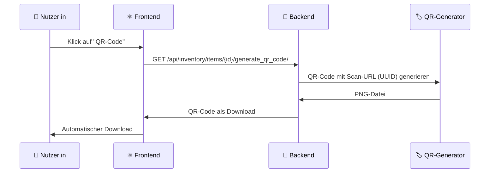

# 📦 EmmaTresor - Moderne Inventarverwaltung

<div align="center">

  
  <p><em>Minimalistische und sichere Inventarverwaltung mit QR-Code-Integration</em></p>
</div>

<div align="center">

[](LICENSE)
[](https://www.python.org/)
[](https://react.dev/)
[](https://www.djangoproject.com/)
[](https://www.typescriptlang.org/)
[](https://www.docker.com/)

</div>

---

**EmmaTresor** ist eine moderne, sichere Inventar-Anwendung mit Django REST Framework Backend und React Frontend. Die Anwendung bietet eine vollständige QR-Code-Integration, robuste Authentifizierung und eine skalierbare Architektur für Teams und Einzelprojekte.

## 🎯 Zweck

Dieses Repository dient als umfassendes, gut dokumentiertes Inventarverwaltungssystem. Es ist sowohl als Lernressource als auch als produktionsreife Anwendung konzipiert. Der Code ist vollständig mit Python-Dokstrings im Google-Stil für das Backend und JSDoc-Kommentaren für das Frontend dokumentiert.

## 🧭 Onboarding für neue Entwickler:innen

1. **Überblick verschaffen**  
   - Überfliege den Abschnitt [Projektstruktur](#-projektstruktur), um zu verstehen, wie Django, DRF, React und Vite zusammenarbeiten.  
   - Sieh dir `env.example` sowie den Ordner `docs/` an, um einen Überblick über verfügbare Umgebungsvariablen und Deployment-Hinweise zu erhalten.

2. **Stack starten**  
   - Installiere Python 3.12+, Node 20+ und optional Docker.  
   - Kopiere `env.example` nach `.env` (Backend) und `.env.local` (Frontend) und ergänze geheime Werte wie Datenbank-Zugänge oder JWT-Cookie-Einstellungen.  
   - Führe `py -3.12 setup_backend.py --use-venv` (oder `python3 setup_backend.py --use-venv`) aus, um `.venv` zu erstellen, Backend-Abhängigkeiten zu installieren, Migrationen durchzuführen, Tests laufen zu lassen und optional das Frontend zu installieren bzw. zu bauen.  
   - Starte `py -3.12 run_backend.py --use-venv --start-frontend`, um Django auf `127.0.0.1:8000` und Vite auf `127.0.0.1:5173` zu starten.

3. **Tägliche Entwicklungsroutine**  
   - Nur Backend: `py -3.12 run_backend.py --use-venv --skip-tests` (Tests wurden bereits ausgeführt) oder `python manage.py test`, wenn nötig.  
   - Nur Frontend: `cd frontend && npm install && npm run dev`.  
   - Full-Stack mit Hot-Reload: Nutze `run_backend.py --start-frontend`, um beide Server mit automatischem Reload zu betreiben.

4. **Wesentliche Nutzungstipps**  
   - Erstelle eine Superuser:in mit `AUTO_CREATE_SUPERUSER=1` in `.env` oder über `python manage.py createsuperuser`.  
   - Besuche `http://127.0.0.1:5173` (Vite-Dev-Server) oder `http://127.0.0.1:8000` (Django), melde dich an, lege Tags/Standorte an und beginne mit dem Scannen von Asset-Tags.

### Dokumentationsstandards

- **Backend**: Google-Style-Dokstrings beschreiben jedes öffentliche Modul, jede Klasse, Funktion und Methode. Sie erläutern Intention, Parameter und Rückgabewerte, damit der Django/DRF-Code selbsterklärend bleibt.  
- **Frontend**: React-Komponenten, Hooks, API-Helfer und Zustand-Stores nutzen JSDoc, sodass Props, Zustandsübergänge und Rückgabetypen in modernen IDEs transparent sind.  
- **Tests**: Unit- und Integrationstests enthalten Dokstrings, die ihr Szenario beschreiben, sodass Fehler unmittelbar das erwartete Verhalten kommunizieren.  
- **README**: Dient als zentrale Einstiegshilfe für neue Personen – halte dieses Dokument aktuell, sobald sich Arbeitsabläufe oder Architektur ändern.

## ✨ Hauptfunktionen

- 🔐 **Sicherheit**: Argon2-Hashing, JWT-Authentifizierung, CSRF-/CORS-Schutz
- 📱 **QR-Code-Integration**: Automatische Generierung mit Asset-Tag-URLs
- 🚀 **Moderne Technologien**: React 19.1, Django 5.2, TypeScript 5.6, Vite 6, Tailwind CSS 3.4
- 🐳 **Docker-bereit**: Vollständige Containerisierung mit Docker Compose
- 📊 **Dashboard**: Klar strukturierte Statistiken und Inventarauswertungen
- 🏷️ **Asset-Management**: UUID-basierte Asset-Tags zur eindeutigen Identifikation

## 📋 Inhaltsverzeichnis

- [🚀 Schnelleinstieg](#-schnelleinstieg)
  - [📦 Setup über Skripte](#-setup-uber-skripte)
  - [🔧 Manuelles Setup](#-manuelles-setup)
  - [⚛️ Frontend-Entwicklung](#️-frontend-entwicklung)
- [📱 QR-Code-Integration](#-qr-code-integration)
  - [🏷️ QR-Code erzeugen](#️-qr-code-erzeugen)
  - [📸 QR-Code scannen](#-qr-code-scannen)
- [🐳 Docker-Bereitstellung](#-docker-bereitstellung)
- [⚙️ Konfiguration](#️-konfiguration)
- [🧪 Tests & Qualitätssicherung](#-tests--qualitatssicherung)
- [📁 Projektstruktur](#-projektstruktur)
- [🔐 Sicherheit](#-sicherheit)
- [🛠️ Fehlerbehebung](#️-fehlerbehebung)
- [🗺️ Roadmap](#️-roadmap)
- [🤝 Mitwirken](#-mitwirken)
- [📄 Lizenz](#-lizenz)
- [📜 Dokumentation](#-dokumentation)

## 📖 Nutzung

Sobald die Anwendung läuft, kannst du ein Konto anlegen und dein Inventar verwalten. Zu den Hauptfunktionen gehören:

- **Dashboard**: Verschaffe dir einen Überblick, inklusive Gesamtanzahl der Gegenstände, Listen und Inventarwert.
- **Inventar**: Füge Gegenstände hinzu, bearbeite oder lösche sie. Filter- und Suchfunktionen unterstützen dich beim Auffinden.
- **Listen**: Erstelle und verwalte Listen mit ausgewählten Gegenständen.
- **QR-Codes**: Generiere und scanne QR-Codes, um schnell auf Details zuzugreifen.
- **Einstellungen**: Verwalte deine Tags und Standorte.

## 🛠️ Technologiestack

<table>
<tr>
<td><strong>🔧 Backend</strong></td>
<td>


</td>
</tr>
<tr>
<td><strong>⚛️ Frontend</strong></td>
<td>


</td>
</tr>
<tr>
<td><strong>🐳 DevOps</strong></td>
<td>


</td>
</tr>
</table>

## 🏗️ Architekturübersicht



### 🔧 Komponentenstruktur

- **`inventory/`** – Django-App mit REST-APIs für Authentifizierung und Inventarverwaltung
- **`frontend/`** – React/Vite-Anwendung mit TypeScript und modernen UI-Komponenten
- **`docker/`** – Container-Konfigurationen für alle Services
- **Nginx** – Reverse Proxy für API-Aufrufe und statische Inhalte

## 🚀 Schnelleinstieg

> 💡 **Tipp**: Für den schnellsten Einstieg nutze die automatisierten Skripte!

### 📦 Setup über Skripte

**📋 Voraussetzungen:**
- 🐍 Python 3.12+ (getestet mit 3.12 und 3.13)
- 📦 Node.js 22+
- 📋 npm
- 🐳 Docker & Docker Compose (optional)

#### Windows (PowerShell)
```powershell
# 1️⃣ Backend einrichten (.venv erstellen, Abhängigkeiten installieren, Migrationen ausführen)
py -3.12 setup_backend.py --use-venv
# oder mit Python 3.13:
py -3.13 setup_backend.py --use-venv

# 2️⃣ Backend und Frontend starten
py -3.12 run_backend.py --use-venv --start-frontend
```

#### Linux/macOS (Bash)
```bash
# 1️⃣ Backend einrichten
python3 setup_backend.py --use-venv

# 2️⃣ Backend und Frontend starten
python3 run_backend.py --use-venv --start-frontend
```

**🎯 Ergebnis:**
- 🔧 Django-Backend: `http://127.0.0.1:8000/`
- ⚛️ React-Frontend: `http://127.0.0.1:5173/`

<details>
<summary>🔧 Virtuelle Umgebung manuell aktivieren</summary>

**Windows:**
```powershell
\.\.venv\Scripts\Activate.ps1
```

**Linux/macOS:**
```bash
source .venv/bin/activate
```
</details>

### 🔧 Manuelles Setup

<details>
<summary>📋 Schritt-für-Schritt-Anleitung</summary>

#### Backend-Setup
```bash
# 1️⃣ Virtuelle Umgebung erstellen
python -m venv .venv

# 2️⃣ Aktivieren (siehe oben)
# Windows: .venv\Scripts\Activate.ps1
# Linux/macOS: source .venv/bin/activate

# 3️⃣ Abhängigkeiten installieren
pip install -r requirements.txt

# 4️⃣ Datenbankmigrationen ausführen
python manage.py migrate

# 5️⃣ Entwicklungsserver starten
python manage.py runserver
```

**✅ Backend erreichbar unter:** `http://127.0.0.1:8000/`

</details>

### ⚛️ Frontend-Entwicklung

#### Schnellstart
```bash
cd frontend
npm install          # Abhängigkeiten installieren
npm run dev          # Dev-Server starten
```

**🌐 Frontend-URLs:**
- 🔧 Entwicklung: `http://127.0.0.1:5173/`
- 📡 API-Proxy: Leitet automatisch an das Django-Backend weiter

#### Produktions-Build
```bash
npm run build        # Build erstellen
npm run preview      # Build testen
npm run typecheck    # TypeScript prüfen
```

> 📱 **Produktivbetrieb:**
> Für HTTPS nutze `npm run dev -- --host --https`
> oder setze einen Reverse Proxy mit TLS-Termination ein.

## 📱 QR-Code-Integration

### 🏷️ QR-Code erzeugen



**📋 Schritte:**
1. 📝 **Artikel auswählen** in der Inventarliste
2. 🏷️ **QR-Code-Schaltfläche klicken**
3. 📥 **PNG herunterladen** für Etiketten/Tags
4. 🖨️ **Ausdrucken** und am Gegenstand anbringen

**🔑 QR-Code-Format:**
Der generierte QR-Code enthält eine URL im Format:
```
https://deine-domain.de/scan/{asset-tag-uuid}
```

### 📸 QR-Code scannen

**📱 Mit jeder QR-App scannen:**
1. 📷 **Standard-QR-Scanner** oder Kamera-App nutzen
2. 🔍 **QR-Code erfassen** – Link wird automatisch erkannt
3. 🌐 **Link öffnen** – führt direkt zu `/scan/{asset_tag}`
4. 📊 **Artikeldetails** werden angezeigt

**📝 Direktansicht & Bearbeitung:**
- 📊 Alle Artikeldetails einsehen
- 📍 Standorte und Tags ansehen
- 🖼️ Bildanhänge betrachten
- ✏️ Über "Bearbeiten" Anpassungen vornehmen

> 💡 **Hinweis:** Das Projekt verwendet **URL-basierte QR-Codes**, die mit jeder gängigen QR-Scanner-App funktionieren. Eine In-App-Kameraintegration ist vorbereitet (Abhängigkeiten installiert), aber noch nicht umgesetzt.

## 🐳 Docker-Bereitstellung

### 🚀 Schnelles Deployment

```bash
# 1️⃣ Umgebungsvariablen konfigurieren
cp env.example .env
# ✏️ Passe .env an (siehe Konfiguration)

# 2️⃣ Sicherheitslog-Verzeichnis anlegen
mkdir -p logs
chmod 755 logs

# 3️⃣ Stack starten
docker compose up --build -d

# 4️⃣ Volume-Berechtigungen setzen (WICHTIG bei der ersten Installation!)
docker compose run --rm --user root backend \
  chown -R 1000:1000 /vol/web/static /vol/web/media /vol/web/private_media
chown 1000:1000 logs

# 5️⃣ Backend neu starten (nach dem Berechtigungsfix)
docker compose restart backend

# 6️⃣ Status prüfen
docker compose ps
```

### ⚠️ Troubleshooting: Backend startet ständig neu

Wenn das Backend mit dem Status `Restarting (1)` abstürzt:

```bash
# 1. Logs prüfen
docker compose logs backend --tail=50

# 2. Häufigste Ursache: Berechtigungsfehler
# Wenn "Permission denied: '/vol/web/static/...'" in den Logs erscheint:
docker compose stop backend
docker compose run --rm --user root backend \
  chown -R 1000:1000 /vol/web/static /vol/web/media /vol/web/private_media
docker compose up -d backend

# 3. Status verifizieren
docker compose ps  # Backend sollte "Up" sein, nicht "Restarting"
```

### 📊 Monitoring & Logs

```bash
# 🔍 Live-Logs ansehen
docker compose logs -f backend
docker compose logs -f nginx

# 📊 Container-Status
docker compose ps

# 🚯 Stack stoppen
docker compose down

# 🗑️ Volumes löschen (Warnung: Datenverlust!)
docker compose down -v
```

### 💾 Datenbank-Backup & -Wiederherstellung

#### Backup erstellen
```bash
# Manuelles Backup mit Zeitstempel
docker compose exec postgres pg_dump -U emmatresor -d emmatresor > backup_$(date +%Y%m%d_%H%M%S).sql

# Komprimiertes Backup
docker compose exec postgres pg_dump -U emmatresor -d emmatresor | gzip > backup_$(date +%Y%m%d_%H%M%S).sql.gz

# Backup im Verzeichnis speichern
mkdir -p db_backups
docker compose exec postgres pg_dump -U emmatresor -d emmatresor > db_backups/backup_$(date +%Y%m%d).sql
```

#### Backup wiederherstellen
```bash
# Wiederherstellung aus SQL-Datei
docker compose exec -T postgres psql -U emmatresor -d emmatresor < backup_20250930.sql

# Wiederherstellung aus komprimierter Datei
gunzip -c backup_20250930.sql.gz | docker compose exec -T postgres psql -U emmatresor -d emmatresor

# ⚠️ WARNUNG: Datenbank vor Restore leeren
docker compose exec postgres psql -U emmatresor -d emmatresor -c "DROP SCHEMA public CASCADE; CREATE SCHEMA public;"
```

#### Automatische Backups (Cron)
```bash
# Crontab bearbeiten
crontab -e

# Tägliches Backup um 2 Uhr
0 2 * * * cd /pfad/zu/emmatresor && docker compose exec postgres pg_dump -U emmatresor -d emmatresor > db_backups/backup_$(date +\%Y\%m\%d).sql 2>&1

# Wöchentliches Backup mit Aufräumen (letzte 4 Wochen behalten)
0 3 * * 0 cd /pfad/zu/emmatresor && docker compose exec postgres pg_dump -U emmatresor -d emmatresor | gzip > db_backups/backup_$(date +\%Y\%m\%d).sql.gz && find db_backups/ -name "*.sql.gz" -mtime +28 -delete
```

> 💡 **Tipp:** Für automatisierte Backups Umgebungsvariablen aus `.env` nutzen:
> ```bash
> source .env && docker compose exec postgres pg_dump -U "$POSTGRES_USER" -d "$POSTGRES_DB" > backup.sql
> ```

### 🏢 Service-Architektur

| Service | Port | Beschreibung | Volumes |
|---------|------|--------------|----------|
| 🐘 **postgres** | 5432 | PostgreSQL-16-Datenbank | `postgres_data` |
| 🐍 **backend** | 8000 | Django 5.2 + Gunicorn 22 API | `backend_static`, `backend_media`, `backend_private_media` |
| 🌐 **nginx** | 8888:80 | Reverse Proxy + Frontend | `backend_static`, `backend_media` |

**🌐 Zugriff nach Deployment:**
- Frontend: `http://localhost:8888/`
- API: `http://localhost:8888/api/`
- Admin: `http://localhost:8888/admin/`

## ⚙️ Konfiguration

> 📝 **Basis:** Kopiere `env.example` nach `.env` und passe die Werte an.

### 🔑 Sicherheitsvariablen

| Variable | Beschreibung | ⚠️ Wichtigkeit |
|----------|--------------|----------------|
| `DJANGO_SECRET_KEY` | Django-Secret Key | 🔴 **KRITISCH** |
| `POSTGRES_PASSWORD` | Datenbankpasswort | 🔴 **KRITISCH** |
| `DJANGO_SUPERUSER_PASSWORD` | Admin-Passwort | 🗽 **HOCH** |

### 🌐 Host & Netzwerk

| Variable | Beschreibung | Standard |
|----------|--------------|----------|
| `DJANGO_ALLOWED_HOSTS` | Erlaubte Hostnamen | `127.0.0.1,localhost` |
| `CSRF_TRUSTED_ORIGINS` | CSRF-Ursprünge | siehe `env.example` |
| `VITE_API_BASE_URL` | API-Basis-URL im Frontend | `/api` |

### 📊 Entwicklung & Features

| Variable | Beschreibung | Standard |
|----------|--------------|----------|
| `DJANGO_DEBUG` | Debug-Modus | `True` (Dev), `False` (Prod) |
| `DJANGO_FORCE_SSL` | HTTPS erzwingen | `0` (Dev), `1` (Prod) |
| `DJANGO_SSL_REDIRECT` | Django-SSL-Redirect | `0` |
| `ALLOW_USER_REGISTRATION` | Benutzerregistrierung erlauben | `false` |
| `AUTO_CREATE_SUPERUSER` | Admin automatisch erstellen | `false` |
| `VITE_ENABLE_QR_SCANNER` | QR-Scanner aktivieren | `true` |

### 📦 Datenbank

| Variable | Beschreibung | Standard |
|----------|--------------|----------|
| `DB_VENDOR` | Datenbanktyp | `postgres` |
| `POSTGRES_DB` | Datenbankname | `emmatresor` |
| `POSTGRES_USER` | Datenbankbenutzer | `emmatresor` |
| `POSTGRES_HOST` | Datenbank-Host | `localhost` |
| `POSTGRES_PORT` | Datenbank-Port | `5432` |

## 🧪 Tests & Qualitätssicherung

### 🐍 Backend-Tests
```bash
# Django-Tests ausführen
python manage.py test

# Oder mit setup_backend.py
python setup_backend.py --tests-only --use-venv

# Mit Coverage (optional)
pip install coverage
coverage run --source='.' manage.py test
coverage report
```

### ⚛️ Frontend-Qualität
```bash
cd frontend

# TypeScript-Prüfung
npm run typecheck

# Build-Test
npm run build

# Build-Vorschau
npm run preview
```

### 🔄 CI/CD-Empfehlungen
- **GitHub Actions** für automatisierte Tests
- **pytest** für erweiterte Backend-Tests
- **Jest/Vitest** für Frontend-Unit-Tests
- **Cypress/Playwright** für End-to-End-Tests

## 📁 Projektstruktur

```text
📁 EmmaTresor/
├── 🐍 EmmaTresor/            # Django-Projektkonfiguration
│   ├── settings.py        # ⚙️ Zentrale Konfiguration
│   ├── urls.py            # 🌐 URL-Routing
│   ├── middleware.py      # 🔧 Custom Middleware (CSRF-Ausnahmen für die API)
│   ├── wsgi.py            # 🚀 WSGI-Schnittstelle
│   └── asgi.py            # 🚀 ASGI-Schnittstelle
├── 📦 inventory/             # Backend-App (Kern)
│   ├── models.py          # 📊 Datenmodelle (Item, Tag, Location, ItemList)
│   ├── views.py           # 🔌 API-Endpunkte
│   ├── serializers.py     # 🔄 JSON-Serialisierung
│   ├── authentication.py  # 🔐 Cookie-JWT-Authentifizierung
│   ├── storage.py         # 💾 Speicher für private Medien
│   ├── urls.py            # 🌐 App-spezifische URLs
│   └── migrations/        # 📝 Datenbankmigrationen
├── ⚛️ frontend/              # React/Vite-Frontend
│   ├── src/
│   │   ├── components/    # 🧩 UI-Komponenten
│   │   ├── pages/         # 📱 Seitenkomponenten
│   │   ├── routes/        # 🛣️ Routen & Guards
│   │   ├── api/           # 📡 API-Client (Axios)
│   │   ├── store/         # 💾 Zustandsverwaltung (Zustand)
│   │   ├── hooks/         # 🎣 Eigene Hooks
│   │   ├── types/         # 📝 TypeScript-Typen
│   │   └── utils/         # 🔧 Hilfsfunktionen
│   ├── package.json       # 📦 Abhängigkeiten
│   ├── vite.config.ts     # ⚙️ Vite-Konfiguration
│   └── tsconfig.json      # ⚙️ TypeScript-Konfiguration
├── 🐳 docker/                # Container-Setup
│   ├── backend/
│   │   ├── Dockerfile     # 🐍 Backend-Image
│   │   └── entrypoint.sh  # 🚀 Startskript für den Container
│   ├── frontend/Dockerfile# ⚛️ Frontend-Image
│   └── nginx/Dockerfile   # 🌐 Proxy-Image
├── 📄 docs/                  # Dokumentation
│   └── SECURITY.md        # 🔐 Sicherheitshinweise
├── 🔐 nginx/                 # Nginx-Konfiguration
│   ├── emmatresor.conf    # 🌐 Docker-Compose-Konfiguration
│   └── emmatresor_host.conf # 🌐 Host-Konfiguration
├── 📋 templates/             # Django-Templates
├── 🚀 Setup & Scripts
│   ├── setup_backend.py   # 🔧 Auto-Setup (Python 3.12+)
│   ├── run_backend.py     # ▶️ Dev-Server
│   ├── deploy_ubuntu.sh   # 🐧 Deployment-Skript für Ubuntu
│   └── manage.py          # 🐍 Django-CLI
└── 📄 Konfiguration
    ├── requirements.txt   # 🐍 Python-Abhängigkeiten
    ├── docker-compose.yml # 🐳 Services (postgres, backend, nginx)
    ├── env.example        # ⚙️ Vorlage für Umgebungsvariablen
    └── .env.production    # 🏭 Produktionskonfiguration
```

## 🔐 Sicherheit

### 🔑 Authentifizierung & Autorisierung
- **💪 Argon2-Hashing** für Passwörter (State-of-the-Art)
- **🎩 JWT-Tokens** mit SimpleJWT und Refresh-Mechanismus
- **🚪 Rate-Limiting** für Login-Versuche
- **🚫 Logout-Blacklisting** verhindert Token-Wiederverwendung

### 🌐 Web-Sicherheit
- **🍪 Sichere Cookies** (HttpOnly, Secure, SameSite)
- **🔒 CSP-Header** (Content Security Policy)
- **🔐 HSTS** zur Erzwingung von HTTPS (Produktion)
- **🚫 CORS-Schutz** mit restriktiven Origins

### 🛡️ Frontend-Schutz
- **🔑 Token-Speicherung** in sicherem Local Storage
- **🚪 Routenwächter** (`ProtectedRoute`, `PublicRoute`)
- **✅ Formularvalidierung** mit Zod + React Hook Form
- **🔄 Automatisches Logout** bei Token-Ablauf

### 📊 Backend-Validierung
- **🏷️ Eingabesäuberung** für alle API-Endpunkte
- **📝 Schema-Validierung** mit DRF-Serializern
- **🚫 Schutz vor SQL-Injection** durch die Django-ORM

> 📜 **Mehr Details:** Siehe `docs/SECURITY.md` für umfassende Sicherheitshinweise.

## 🧪 Tests ausführen

Um die Test-Suite zu starten, setze zuerst die erforderlichen Umgebungsvariablen:

```bash
export DJANGO_SECRET_KEY='ein-langer-und-zufälliger-sicherheitsschlüssel'
export DB_VENDOR='sqlite'
export DJANGO_DEBUG='True'
```

Führe anschließend die Tests über `manage.py` aus:

```bash
python manage.py test
```

## 🔧 Fehlerbehebung

### 📷 QR-Code-Probleme

| Problem | Lösung |
|---------|--------|
| 📥 **QR-Code-Download fehlgeschlagen** | ✅ Erneut anmelden (JWT-Token aktualisieren)<br/>✅ Ist das Backend erreichbar? Netzwerk prüfen! |
| 🔍 **Scan führt zu 404** | ✅ Stimmt der Asset-Tag? Existiert der Artikel noch?<br/>✅ Läuft und antwortet das Backend? |
| 🖨️ **QR-Code lässt sich nicht drucken** | ✅ Druckeinstellungen des Browsers prüfen<br/>✅ PNG herunterladen und separat drucken |

### 🐍 Backend-Probleme

| Problem | Lösung |
|---------|--------|
| 📦 **qrcode[pil] fehlt** | `pip install -r requirements.txt` ausführen |
| 📊 **Migrationen schlagen fehl** | `python manage.py migrate --run-syncdb` |
| 🔑 **Authentifizierungsfehler** | `.env` prüfen, `DJANGO_SECRET_KEY` setzen |
| 🐘 **PostgreSQL-Verbindung** | Ist `POSTGRES_PASSWORD` in `.env` gesetzt? `DB_VENDOR=postgres`? |
| 📁 **Zeichensatz-Probleme** | `fix_charset_live.sh` ausführen (UTF-8 Fix) |

### ⚛️ Frontend-Probleme

| Problem | Lösung |
|---------|--------|
| 📡 **API-Verbindung fehlgeschlagen** | Läuft das Backend auf Port 8000? CORS richtig konfiguriert? |
| 🔄 **Build-Fehler** | `npm run typecheck` ausführen, sind alle Abhängigkeiten aktuell? |
| 📏 **Routing-Probleme** | Browser-Cache leeren, Hard-Refresh (Strg+F5) |
| 🍪 **Cookie-Authentifizierung** | `JWT_COOKIE_SECURE=0` in Dev setzen, Cookies aktiviert? |

## 🗺️ Roadmap

### 🔜 **Kurzfristig (2025 Q1-Q2)**
- 📸 **In-App-QR-Scanner** mit Kamerazugriff (@yudiel/react-qr-scanner)
- 📋 **Drag & Drop** für Listenverwaltung
- 📥 **Bulk-Import** für CSV/Excel-Dateien
- 🖼️ **Erweiterte Bildergalerie** mit Vollbildansicht
- 📊 **Statistik-Exporte** (PDF, Excel)

### 🔝 **Mittelfristig (2025 Q2-Q3)**
- 🧪 **Erweiterte Test-Suites** (pytest, Jest, Cypress E2E)
- 🔄 **CI/CD-Pipeline** mit GitHub Actions
- 📈 **Analyse-Dashboard** mit erweiterten Kennzahlen
- 📱 **PWA-Unterstützung** für Offline-Betrieb
- 🔔 **Benachrichtigungssystem** für wichtige Ereignisse

### 🔞 **Langfristig (ab 2025 Q4)**
- 🔐 **SECRET_KEY-Rotation** und erweiterte Sicherheitsmaßnahmen
- 🌐 **Multi-Tenant-Support** für Teams und Organisationen
- ☁️ **Cloud-Speicher** (S3/MinIO) mit automatischer Migration
- 📄 **OpenAPI-Dokumentation** via DRF Spectacular
- 🔍 **Erweiterte Suche** (Elasticsearch/Meilisearch)
- 🌍 **Mehrsprachiger Support** (i18n)

## 🤝 Mitwirken

Beiträge sind ausdrücklich willkommen! 🎉

### 📝 Richtlinien für Beiträge

1. **🌴 Fork & Branch**
   ```bash
   git fork https://github.com/your-repo/EmmaTresor
   git checkout -b feature/meine-neue-funktion
   ```

2. **🧪 Tests ausführen**
   ```bash
   # Backend
   python manage.py test

   # Frontend
   cd frontend
   npm run typecheck
   npm run build
   ```

3. **✏️ Commit-Standards**
   - 🌟 Verwende [Conventional Commits](https://conventionalcommits.org/)
   - 🗺️ Aussagekräftige Commit Messages
   - 📈 Ein Feature = Ein Commit (bei Bedarf squashen)

4. **🚀 Pull Request**
   - 📋 Detaillierte Beschreibung der Änderungen
   - 🖼️ Screenshots bei UI-Anpassungen
   - ✅ Alle Tests laufen erfolgreich

### 🐛 Bugs & Feature-Wünsche

- **🐛 Bugs:** [Issues](https://github.com/your-repo/EmmaTresor/issues) mit Label "bug"
- **✨ Features:** [Issues](https://github.com/your-repo/EmmaTresor/issues) mit Label "enhancement"
- **💬 Diskussionen:** [GitHub Discussions](https://github.com/your-repo/EmmaTresor/discussions)

### 🚀 Entwicklungsstandards

- **🐍 Backend:** Django Best Practices, PEP 8
- **⚛️ Frontend:** TypeScript strict mode, ESLint + Prettier
- **📄 Dokumentation:** Inline-Kommentare + README aktuell halten
- **🔐 Sicherheit:** Keine Secrets in Commits!

---

## 📄 Lizenz

Dieses Projekt steht unter der **GNU General Public License Version 3.0** (GPL-v3).

© 2024 EmmaTresor Contributors

**📜 [Vollständiger Lizenztext](LICENSE)**

---

<div align="center">
  <p>
    <strong>🚀 Erstellt mit ❤️ von der EmmaTresor-Community</strong>
  </p>
  <p>
    <a href="#-emmatresor---moderne-inventarverwaltung">⬆️ Zurück nach oben</a>
  </p>
</div>

---

## 📜 Dokumentation

Dieses Repository ist vollständig mit Docstrings dokumentiert. Jede öffentliche Funktion, Methode und Klasse enthält eine Beschreibung ihres Zwecks, ihrer Parameter und Rückgabewerte.

- **Backend (Python)**: Docstrings im Google-Stil
- **Frontend (TypeScript)**: JSDoc-Kommentare

Diese Dokumentation dient als Referenz für Entwickler:innen und erleichtert den Einstieg in den Code.
