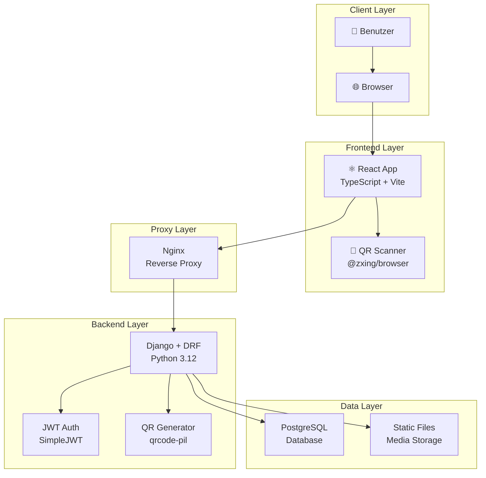
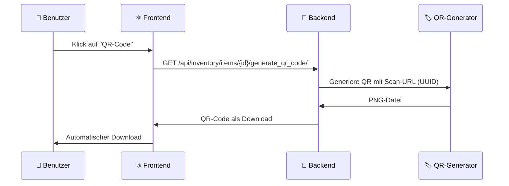

# 📦 EmmaTresor - Modern Inventory Management

<div align="center">

  
  <p><em>Minimalistische und sichere Inventarverwaltung mit QR-Code-Integration</em></p>
</div>

<div align="center">

[](LICENSE)
[](https://www.python.org/)
[](https://react.dev/)
[](https://www.djangoproject.com/)
[](https://www.typescriptlang.org/)
[](https://www.docker.com/)

</div>

---

**EmmaTresor** ist eine moderne, sichere Inventar-Anwendung mit Django REST Framework Backend und React Frontend. Die Anwendung bietet eine vollständige QR-Code-Integration, robuste Authentifizierung und eine skalierbare Architektur für Teams und Einzelprojekte.

## ✨ Hauptmerkmale

- 🔐 **Sicherheit**: Argon2-Hashing, JWT-Authentifizierung, CSRF/CORS-Schutz
- 📱 **QR-Code-Integration**: Automatische Generierung mit Asset-Tag-URLs
- 🚀 **Moderne Technologien**: React 19.1, Django 5.2, TypeScript 5.6, Vite 6, Tailwind CSS 3.4
- 🐳 **Docker-Ready**: Vollständige Containerisierung mit Docker Compose
- 📊 **Dashboard**: Übersichtliche Statistiken und Inventarauswertungen
- 🏷️ **Asset-Management**: UUID-basierte Asset-Tags für eindeutige Identifikation

## 📋 Inhaltsverzeichnis

- [🚀 Schnellstart](#-schnellstart)
  - [📦 Setup über Skripte](#-setup-über-skripte)
  - [🔧 Manuelle Einrichtung](#-manuelle-einrichtung)
  - [⚛️ Frontend-Entwicklung](#️-frontend-entwicklung)
- [📱 QR-Code-Integration](#-qr-code-integration)
  - [🏷️ QR-Code generieren](#️-qr-code-generieren)
  - [📸 QR-Code scannen](#-qr-code-scannen)
- [🐳 Docker Deployment](#-docker-deployment)
- [⚙️ Konfiguration](#️-konfiguration)
- [🧪 Tests & Qualitätssicherung](#-tests--qualitätssicherung)
- [📁 Projektstruktur](#-projektstruktur)
- [🔐 Sicherheit](#-sicherheit)
- [🛠️ Troubleshooting](#️-troubleshooting)
- [🗺️ Roadmap](#️-roadmap)
- [🤝 Beitragen](#-beitragen)
- [📄 Lizenz](#-lizenz)

## 📖 Detaillierte Funktionen

### 🏢 Inventarverwaltung
- **CRUD-Operationen** für alle Inventargegenstände
- **Mengen- und Werttracking** mit Kaufdatum und monetärem Wert
- **Standort- und Tag-Management** für bessere Organisation
- **Benutzerspezifische Trennung** der Daten mit Datenisolation
- **Änderungsprotokoll** (ItemChangeLog) für Audit-Trails
- **Bildanhänge** mit privater Storage-Implementierung (max. 8MB, PDF-Support)

### 🏷️ QR-Code-System
- **Automatische UUID-Asset-Tags** für jeden Gegenstand (kollisionssicher)
- **Dynamische QR-Code-Generierung** als PNG-Download (qrcode[pil] Backend)
- **URL-basierte Scan-Integration** (über `/scan/{asset_tag}` Route)
- **Direkte Detailansicht** nach dem Scannen mit QR-App
- **Frontend QR-Code-Anzeige** (qrcode Library für Client-Side-Generierung)

### 📊 Listen und Dashboard
- **Benutzerdefinierte Listen** für Projekte und Übergaben
- **Aggregierte Statistiken** und Wertberechnungen
- **Performance-optimiert** mit Pagination und Suche
- **Responsive Design** für alle Geräte

### 🔒 Sicherheit und Authentifizierung
- **JWT-basierte Authentifizierung** mit SimpleJWT und Cookie-Support
- **Rate-Limiting** (5 Login-Versuche/min) und Logout-Blacklisting
- **CSRF/CORS-Schutz** mit gehärteter Konfiguration und Custom Middleware
- **Sichere Token-Verwaltung** (HttpOnly Cookies, SameSite, Secure flags)
- **CSP-Header** (Content Security Policy) für XSS-Schutz
- **HSTS** für HTTPS-Erzwingung in Produktion

## 🛠️ Technologie-Stack

<table>
<tr>
<td><strong>🔧 Backend</strong></td>
<td>


</td>
</tr>
<tr>
<td><strong>⚛️ Frontend</strong></td>
<td>


</td>
</tr>
<tr>
<td><strong>🐳 DevOps</strong></td>
<td>


</td>
</tr>
</table>

## 🏗️ Architektur-Übersicht



### 🔧 Komponentenstruktur

- **`inventory/`** - Django-App mit REST-APIs für Authentifizierung und Inventarverwaltung
- **`frontend/`** - React/Vite-Anwendung mit TypeScript und modernen UI-Komponenten
- **`docker/`** - Container-Konfigurationen für alle Services
- **Nginx** - Reverse Proxy für API-Calls und statische Asset-Bereitstellung

## 🚀 Schnellstart

> 💡 **Tipp**: Für die schnellste Einrichtung verwende die automatisierten Skripte!

### 📦 Setup über Skripte

**📋 Voraussetzungen:**
- 🐍 Python 3.12+ (getestet mit 3.12 und 3.13)
- 📦 Node.js 22+
- 📋 npm
- 🐳 Docker & Docker Compose (optional)

#### Windows (PowerShell)
```powershell
# 1️⃣ Backend-Setup (erstellt .venv, installiert deps, führt Migrationen aus)
py -3.12 setup_backend.py --use-venv
# oder mit Python 3.13:
py -3.13 setup_backend.py --use-venv

# 2️⃣ Starte Backend + Frontend
py -3.12 run_backend.py --use-venv --start-frontend
```

#### Linux/macOS (Bash)
```bash
# 1️⃣ Backend-Setup
python3 setup_backend.py --use-venv

# 2️⃣ Starte Backend + Frontend
python3 run_backend.py --use-venv --start-frontend
```

**🎯 Ergebnis:**
- 🔧 Django Backend: `http://127.0.0.1:8000/`
- ⚛️ React Frontend: `http://127.0.0.1:5173/`

<details>
<summary>🔧 Virtuelle Umgebung manuell aktivieren</summary>

**Windows:**
```powershell
.\.venv\Scripts\Activate.ps1
```

**Linux/macOS:**
```bash
source .venv/bin/activate
```
</details>

### 🔧 Manuelle Einrichtung

<details>
<summary>📋 Schritt-für-Schritt Anleitung</summary>

#### Backend Setup
```bash
# 1️⃣ Virtuelle Umgebung erstellen
python -m venv .venv

# 2️⃣ Aktivieren (siehe oben)
# Windows: .venv\Scripts\Activate.ps1
# Linux/macOS: source .venv/bin/activate

# 3️⃣ Dependencies installieren
pip install -r requirements.txt

# 4️⃣ Datenbank migrieren
python manage.py migrate

# 5️⃣ Entwicklungsserver starten
python manage.py runserver
```

**✅ Backend läuft auf:** `http://127.0.0.1:8000/`

</details>

### ⚛️ Frontend-Entwicklung

#### Schnellstart
```bash
cd frontend
npm install          # Dependencies installieren
npm run dev          # Dev-Server starten
```

**🌐 Frontend URLs:**
- 🔧 Development: `http://127.0.0.1:5173/`
- 📡 API Proxy: Automatisch zu Django Backend

#### Produktionsbuild
```bash
npm run build        # Build erstellen
npm run preview      # Build testen
npm run typecheck    # TypeScript prüfen
```

> 📱 **Produktions-Deployment:** 
> Für HTTPS verwende `npm run dev -- --host --https` 
> oder nutze einen Reverse Proxy mit TLS-Terminierung.

## 📱 QR-Code-Integration

### 🏷️ QR-Code generieren



**📋 Schritte:**
1. 📝 **Item auswählen** in der Inventarliste
2. 🏷️ **QR-Code Button** klicken
3. 📥 **PNG herunterladen** für Labels/Etiketten
4. 🖨️ **Ausdrucken** und an Gegenstand anbringen

**🔑 QR-Code-Format:**
Der generierte QR-Code enthält eine URL im Format:
```
https://deine-domain.de/scan/{asset-tag-uuid}
```

### 📸 QR-Code scannen

**📱 Scannen mit beliebiger QR-App:**
1. 📷 **Standard-QR-Scanner** oder Kamera-App verwenden
2. 🔍 **QR-Code erfassen** - Link wird automatisch erkannt
3. 🌐 **Link öffnen** - führt direkt zu `/scan/{asset_tag}`
4. 📊 **Detailansicht** des Items wird angezeigt

**📝 Direkte Ansicht & Bearbeitung:**
- 📊 Alle Item-Details einsehen
- 📍 Standorte und Tags anzeigen
- 🖼️ Bildanhänge betrachten
- ✏️ "Bearbeiten"-Button für Aktualisierungen

> 💡 **Hinweis:** Das Projekt verwendet **URL-basierte QR-Codes**, die mit jeder Standard-QR-Scanner-App funktionieren. Eine In-App-Kamera-Integration ist vorbereitet (Dependencies installiert), aber noch nicht implementiert.

## 🐳 Docker Deployment

### 🚀 Schnelles Deployment

```bash
# 1️⃣ Umgebungsvariablen konfigurieren
cp env.example .env
# ✏️ .env bearbeiten (siehe Konfiguration)

# 2️⃣ Stack starten
docker compose up --build -d

# 3️⃣ Status prüfen
docker compose ps
```

### 📊 Monitoring & Logs

```bash
# 🔍 Live-Logs anzeigen
docker compose logs -f backend
docker compose logs -f nginx

# 📊 Container-Status
docker compose ps

# 🚯 Stack stoppen
docker compose down

# 🗑️ Volumes löschen (Achtung: Datenverlust!)
docker compose down -v
```

### 🏢 Service-Architektur

| Service | Port | Beschreibung | Volumes |
|---------|------|--------------|----------|
| 🐘 **postgres** | 5432 | PostgreSQL 16 Datenbank | `postgres_data` |
| 🐍 **backend** | 8000 | Django 5.2 + Gunicorn 22 API | `backend_static`, `backend_media`, `backend_private_media` |
| 🌐 **nginx** | 8888:80 | Reverse Proxy + Frontend | `backend_static`, `backend_media` |

**🌐 Zugriff nach Deployment:**
- Frontend: `http://localhost:8888/`
- API: `http://localhost:8888/api/`
- Admin: `http://localhost:8888/admin/`

## ⚙️ Konfiguration

> 📝 **Basis:** Kopiere `env.example` nach `.env` und passe die Werte an.

### 🔑 Sicherheits-Variablen

| Variable | Beschreibung | ⚠️ Wichtigkeit |
|----------|--------------|----------------|
| `DJANGO_SECRET_KEY` | Django Geheimschlüssel | 🔴 **KRITISCH** |
| `POSTGRES_PASSWORD` | Datenbank-Passwort | 🔴 **KRITISCH** |
| `DJANGO_SUPERUSER_PASSWORD` | Admin-Passwort | 🗽 **HOCH** |

### 🌐 Host & Netzwerk

| Variable | Beschreibung | Standard |
|----------|--------------|----------|
| `DJANGO_ALLOWED_HOSTS` | Erlaubte Hostnamen | `127.0.0.1,localhost` |
| `CSRF_TRUSTED_ORIGINS` | CSRF-Origins | siehe `env.example` |
| `VITE_API_BASE_URL` | Frontend API-Basis | `/api` |

### 📊 Entwicklung & Features

| Variable | Beschreibung | Standard |
|----------|--------------|----------|
| `DJANGO_DEBUG` | Debug-Modus | `True` (Dev), `False` (Prod) |
| `DJANGO_FORCE_SSL` | HTTPS-Erzwingung | `0` (Dev), `1` (Prod) |
| `DJANGO_SSL_REDIRECT` | Django SSL-Redirect | `0` |
| `ALLOW_USER_REGISTRATION` | Nutzerregistrierung | `false` |
| `AUTO_CREATE_SUPERUSER` | Auto-Admin erstellen | `false` |
| `VITE_ENABLE_QR_SCANNER` | QR-Scanner aktivieren | `true` |

### 📦 Datenbank

| Variable | Beschreibung | Standard |
|----------|--------------|----------|
| `DB_VENDOR` | Datenbank-Typ | `postgres` |
| `POSTGRES_DB` | Datenbank-Name | `emmatresor` |
| `POSTGRES_USER` | DB-Benutzer | `emmatresor` |
| `POSTGRES_HOST` | DB-Host | `localhost` |
| `POSTGRES_PORT` | DB-Port | `5432` |

## 🧪 Tests & Qualitätssicherung

### 🐍 Backend-Tests
```bash
# Django Tests ausführen
python manage.py test

# Oder mit setup_backend.py
python setup_backend.py --tests-only --use-venv

# Mit Coverage (optional)
pip install coverage
coverage run --source='.' manage.py test
coverage report
```

### ⚛️ Frontend-Qualität
```bash
cd frontend

# TypeScript Prüfung
npm run typecheck

# Build-Test
npm run build

# Build-Vorschau
npm run preview
```

### 🔄 CI/CD Empfehlungen
- **GitHub Actions** für automatisierte Tests
- **pytest** für erweiterte Backend-Tests  
- **Jest/Vitest** für Frontend-Unit-Tests
- **Cypress/Playwright** für E2E-Tests

## 📁 Projektstruktur

```text
📁 EmmaTresor/
├── 🐍 EmmaTresor/            # Django Projektkonfiguration
│   ├── settings.py        # ⚙️ Hauptkonfiguration
│   ├── urls.py            # 🌐 URL-Routing
│   ├── middleware.py      # 🔧 Custom Middleware (CSRF-Exempt für API)
│   ├── wsgi.py            # 🚀 WSGI Server-Schnittstelle
│   └── asgi.py            # 🚀 ASGI Server-Schnittstelle
├── 📦 inventory/             # Backend-App (Kern)
│   ├── models.py          # 📊 Datenmodelle (Item, Tag, Location, ItemList)
│   ├── views.py           # 🔌 API-Endpunkte
│   ├── serializers.py     # 🔄 JSON-Serialisierung
│   ├── authentication.py  # 🔐 Cookie-JWT-Auth
│   ├── storage.py         # 💾 Private Media Storage
│   ├── urls.py            # 🌐 App-URLs
│   └── migrations/        # 📝 Datenbank-Migrationen
├── ⚛️ frontend/              # React/Vite Frontend
│   ├── src/
│   │   ├── components/    # 🧩 UI-Komponenten
│   │   ├── pages/         # 📱 Seiten-Komponenten
│   │   ├── routes/        # 🛣️ Route Guards & Konfiguration
│   │   ├── api/           # 📡 API-Client (Axios)
│   │   ├── store/         # 💾 Zustand-Management (Zustand)
│   │   ├── hooks/         # 🎣 Custom React Hooks
│   │   ├── types/         # 📝 TypeScript Typen
│   │   └── utils/         # 🔧 Utility-Funktionen
│   ├── package.json       # 📦 Dependencies
│   ├── vite.config.ts     # ⚙️ Vite-Konfiguration
│   └── tsconfig.json      # ⚙️ TypeScript-Konfiguration
├── 🐳 docker/                # Container-Setup
│   ├── backend/
│   │   ├── Dockerfile     # 🐍 Backend-Image
│   │   └── entrypoint.sh  # 🚀 Container-Startskript
│   ├── frontend/Dockerfile# ⚛️ Frontend-Image
│   └── nginx/Dockerfile   # 🌐 Proxy-Image
├── 📄 docs/                  # Dokumentation
│   └── SECURITY.md        # 🔐 Sicherheitshinweise
├── 🔐 nginx/                 # Nginx-Konfiguration
│   ├── emmatresor.conf    # 🌐 Docker Compose Konfiguration
│   └── emmatresor_host.conf # 🌐 Host-System Konfiguration
├── 📋 templates/             # Django-Templates
├── 🚀 Setup & Scripts
│   ├── setup_backend.py   # 🔧 Auto-Setup (Python 3.12+)
│   ├── run_backend.py     # ▶️ Dev-Server
│   ├── deploy_ubuntu.sh   # 🐧 Ubuntu Deployment-Skript
│   └── manage.py          # 🐍 Django CLI
└── 📄 Konfiguration
    ├── requirements.txt   # 🐍 Python-Deps
    ├── docker-compose.yml # 🐳 Services (postgres, backend, nginx)
    ├── env.example        # ⚙️ Umgebungsvariablen-Template
    └── .env.production    # 🏭 Produktions-Konfiguration
```

## 🔐 Sicherheit

### 🔑 Authentifizierung & Autorisierung
- **💪 Argon2-Hashing** für Passwörter (state-of-the-art)
- **🎩 JWT-Token** mit SimpleJWT und Refresh-Mechanismus
- **🚪 Rate-Limiting** für Login-Versuche
- **🚫 Logout-Blacklisting** verhindert Token-Wiederverwendung

### 🌐 Web-Sicherheit
- **🍪 Secure Cookies** (HttpOnly, Secure, SameSite)
- **🔒 CSP-Header** (Content Security Policy)
- **🔐 HSTS** für HTTPS-Erzwingung (Produktion)
- **🚫 CORS-Schutz** mit restriktiven Origins

### 🛡️ Frontend-Schutz
- **🔑 Token-Storage** in sicherem Local Storage
- **🚪 Route Guards** (`ProtectedRoute`, `PublicRoute`)
- **✅ Form-Validation** mit Zod + React Hook Form
- **🔄 Auto-Logout** bei Token-Ablauf

### 📊 Backend-Validierung
- **🏷️ Input-Sanitization** für alle API-Endpunkte
- **📝 Schema-Validation** mit DRF-Serializers
- **🚫 SQL-Injection-Schutz** durch Django ORM

> 📜 **Weitere Details:** Siehe `docs/SECURITY.md` für umfassende Sicherheitsrichtlinien.

## 🔧 Troubleshooting

### 📷 QR-Code Probleme

| Problem | Lösung |
|---------|--------|
| 📥 **QR-Code Download fehlgeschlagen** | ✅ Erneut einloggen (JWT-Token erneuern)<br/>✅ Backend erreichbar? Netzwerkfehler? |
| 🔍 **Scan führt zu 404** | ✅ Asset-Tag korrekt? Item existiert noch?<br/>✅ Backend läuft und ist erreichbar? |
| 🖨️ **QR-Code drucken schlägt fehl** | ✅ Browser-Druckeinstellungen prüfen<br/>✅ PNG herunterladen und separat drucken |

### 🐍 Backend-Probleme

| Problem | Lösung |
|---------|--------|
| 📦 **qrcode[pil] fehlt** | `pip install -r requirements.txt` ausführen |
| 📊 **Migrationen fehlgeschlagen** | `python manage.py migrate --run-syncdb` |
| 🔑 **Authentifizierung-Fehler** | `.env`-Datei prüfen, `DJANGO_SECRET_KEY` setzen |
| 🐘 **PostgreSQL-Verbindung** | `POSTGRES_PASSWORD` in `.env` gesetzt? `DB_VENDOR=postgres`? |
| 📁 **Encoding-Probleme** | `fix_charset_live.sh` ausführen (UTF-8 Fix) |

### ⚛️ Frontend-Probleme

| Problem | Lösung |
|---------|--------|
| 📡 **API-Verbindung fehlgeschlagen** | Backend-Server läuft auf Port 8000? CORS konfiguriert? |
| 🔄 **Build-Fehler** | `npm run typecheck` ausführen, Dependencies aktuell? |
| 📏 **Routing-Probleme** | Browser-Cache leeren, Hard-Refresh (Ctrl+F5) |
| 🍪 **Cookie-Authentifizierung** | `JWT_COOKIE_SECURE=0` in Dev, Cookies aktiviert? |

## 🗺️ Roadmap

### 🔜 **Kurzfristig (2025 Q1-Q2)**
- 📸 **In-App QR-Scanner** mit Kamerazugriff (@yudiel/react-qr-scanner implementieren)
- 📋 **Drag & Drop** für Listen-Management
- 📥 **Bulk-Import** für CSV/Excel-Dateien
- 🖼️ **Erweiterte Bildergalerie** mit Vollbild-Ansicht
- 📊 **Statistik-Exporte** (PDF, Excel)

### 🔝 **Mittelfristig (2025 Q2-Q3)**
- 🧪 **Erweiterte Test-Suites** (pytest, Jest, Cypress E2E)
- 🔄 **CI/CD-Pipeline** mit GitHub Actions
- 📈 **Analytics-Dashboard** mit erweiterten Metriken und Charts
- 📱 **PWA-Support** für Offline-Nutzung
- 🔔 **Benachrichtigungssystem** für wichtige Events

### 🔞 **Langfristig (2025 Q4+)**
- 🔐 **SECRET_KEY-Rotation** und erweiterte Sicherheit
- 🌐 **Multi-Tenant-Support** für Teams und Organisationen
- ☁️ **Cloud-Storage** (S3/MinIO) für Medien mit automatischer Migration
- 📄 **OpenAPI-Dokumentation** mit DRF Spectacular
- 🔍 **Erweiterte Suchfunktion** (Elasticsearch/Meilisearch)
- 🌍 **Multi-Language-Support** (i18n)

## 🤝 Beitragen

Beiträge sind herzlich willkommen! 🎉

### 📝 Contribution Guidelines

1. **🌴 Fork & Branch**
   ```bash
   git fork https://github.com/your-repo/EmmaTresor
   git checkout -b feature/awesome-feature
   ```

2. **🧪 Tests ausführen**
   ```bash
   # Backend
   python manage.py test
   
   # Frontend  
   cd frontend
   npm run typecheck
   npm run build
   ```

3. **✏️ Commit-Standards**
   - 🌟 Verwendung von [Conventional Commits](https://conventionalcommits.org/)
   - 🗺️ Klare, beschreibende Commit-Messages
   - 📈 Ein Feature = Ein Commit (squash wenn nötig)

4. **🚀 Pull Request**
   - 📋 Detaillierte Beschreibung der Änderungen
   - 🖼️ Screenshots bei UI-Änderungen
   - ✅ Alle Tests bestehen

### 🐛 Bug Reports & Feature Requests

- **🐛 Bugs:** [Issues](https://github.com/your-repo/EmmaTresor/issues) mit "bug" Label
- **✨ Features:** [Issues](https://github.com/your-repo/EmmaTresor/issues) mit "enhancement" Label
- **💬 Diskussionen:** [GitHub Discussions](https://github.com/your-repo/EmmaTresor/discussions)

### 🚀 Entwicklungsstandards

- **🐍 Backend:** Django Best Practices, PEP 8
- **⚛️ Frontend:** TypeScript strict mode, ESLint + Prettier
- **📄 Dokumentation:** Inline-Kommentare + README-Updates
- **🔐 Sicherheit:** Keine Secrets in Commits!

---

## 📄 Lizenz

Dieses Projekt steht unter der **GNU General Public License Version 3.0** (GPL-v3).

© 2024 EmmaTresor Contributors

**📜 [Vollständiger Lizenztext](LICENSE)**

---

<div align="center">
  <p>
    <strong>🚀 Erstellt mit ❤️ von der EmmaTresor Community</strong>
  </p>
  <p>
    <a href="#-emmatresor---modern-inventory-management">⬆️ Zurück nach oben</a>
  </p>
</div>

