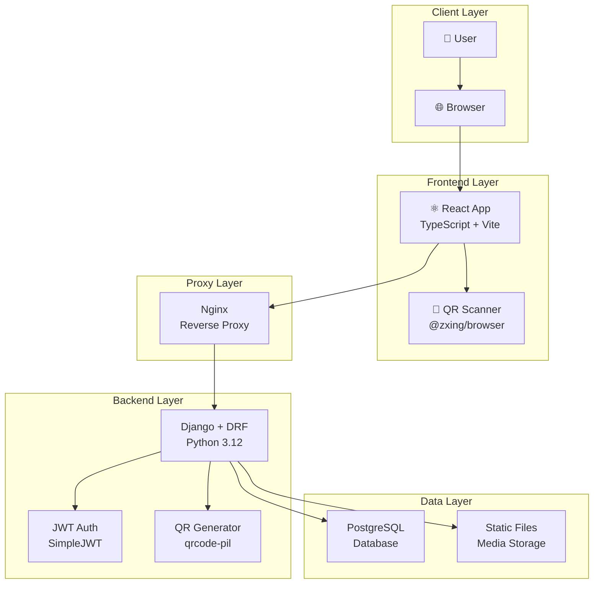
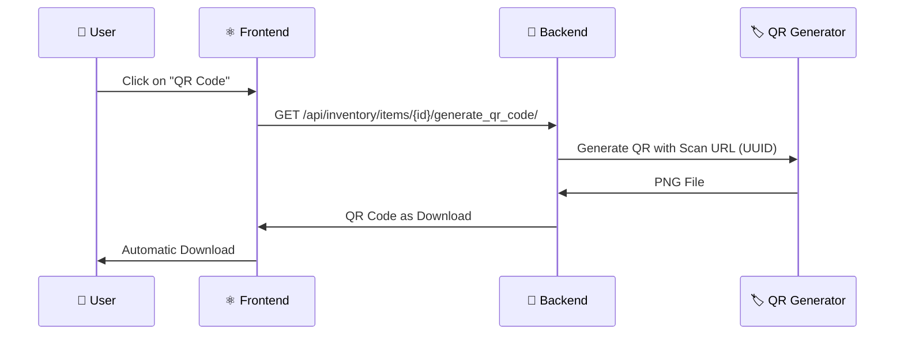

# 📦 EmmaTresor - Modern Inventory Management

<div align="center">

  
  <p><em>Minimalistische und sichere Inventarverwaltung mit QR-Code-Integration</em></p>
</div>

<div align="center">

[](LICENSE)
[](https://www.python.org/)
[](https://react.dev/)
[](https://www.djangoproject.com/)
[](https://www.typescriptlang.org/)
[](https://www.docker.com/)

</div>

---

**EmmaTresor** ist eine moderne, sichere Inventar-Anwendung mit Django REST Framework Backend und React Frontend. Die Anwendung bietet eine vollständige QR-Code-Integration, robuste Authentifizierung und eine skalierbare Architektur für Teams und Einzelprojekte.

## 🎯 Purpose

This repository serves as a comprehensive, well-documented inventory management system. It is designed to be a learning resource and a production-ready application. The codebase is fully documented with Google Style Python Docstrings for the backend and JSDoc for the frontend.

## ✨ Key Features

- 🔐 **Security**: Argon2-Hashing, JWT authentication, CSRF/CORS protection
- 📱 **QR Code Integration**: Automatic generation with asset tag URLs
- 🚀 **Modern Technologies**: React 19.1, Django 5.2, TypeScript 5.6, Vite 6, Tailwind CSS 3.4
- 🐳 **Docker-Ready**: Full containerization with Docker Compose
- 📊 **Dashboard**: Clear statistics and inventory evaluations
- 🏷️ **Asset Management**: UUID-based asset tags for unique identification

## 📋 Table of Contents

- [🚀 Quick Start](#-quick-start)
  - [📦 Setup via Scripts](#-setup-via-scripts)
  - [🔧 Manual Setup](#-manual-setup)
  - [⚛️ Frontend Development](#️-frontend-development)
- [📱 QR Code Integration](#-qr-code-integration)
  - [🏷️ Generate QR Code](#️-generate-qr-code)
  - [📸 Scan QR Code](#-scan-qr-code)
- [🐳 Docker Deployment](#-docker-deployment)
- [⚙️ Configuration](#️-configuration)
- [🧪 Testing & Quality Assurance](#-testing--quality-assurance)
- [📁 Project Structure](#-project-structure)
- [🔐 Security](#-security)
- [🛠️ Troubleshooting](#️-troubleshooting)
- [🗺️ Roadmap](#️-roadmap)
- [🤝 Contributing](#-contributing)
- [📄 License](#-license)
- [📜 Documentation](#-documentation)

## 📖 Usage

Once the application is running, you can create an account and start managing your inventory. The main features include:

- **Dashboard**: Get an overview of your inventory, including total items, lists, and value.
- **Inventory**: Add, edit, and delete items. You can also filter and search for items.
- **Lists**: Create and manage lists of items.
- **QR Codes**: Generate and scan QR codes to quickly access item details.
- **Settings**: Manage your tags and locations.

## 🛠️ Technology Stack

<table>
<tr>
<td><strong>🔧 Backend</strong></td>
<td>


</td>
</tr>
<tr>
<td><strong>⚛️ Frontend</strong></td>
<td>


</td>
</tr>
<tr>
<td><strong>🐳 DevOps</strong></td>
<td>


</td>
</tr>
</table>

## 🏗️ Architecture Overview



### 🔧 Component Structure

- **`inventory/`** - Django app with REST APIs for authentication and inventory management
- **`frontend/`** - React/Vite application with TypeScript and modern UI components
- **`docker/`** - Container configurations for all services
- **Nginx** - Reverse proxy for API calls and static asset serving

## 🚀 Quick Start

> 💡 **Tip**: For the fastest setup, use the automated scripts!

### 📦 Setup via Scripts

**📋 Prerequisites:**
- 🐍 Python 3.12+ (tested with 3.12 and 3.13)
- 📦 Node.js 22+
- 📋 npm
- 🐳 Docker & Docker Compose (optional)

#### Windows (PowerShell)
```powershell
# 1️⃣ Backend Setup (creates .venv, installs deps, runs migrations)
py -3.12 setup_backend.py --use-venv
# or with Python 3.13:
py -3.13 setup_backend.py --use-venv

# 2️⃣ Start Backend + Frontend
py -3.12 run_backend.py --use-venv --start-frontend
```

#### Linux/macOS (Bash)
```bash
# 1️⃣ Backend Setup
python3 setup_backend.py --use-venv

# 2️⃣ Start Backend + Frontend
python3 run_backend.py --use-venv --start-frontend
```

**🎯 Result:**
- 🔧 Django Backend: `http://127.0.0.1:8000/`
- ⚛️ React Frontend: `http://127.0.0.1:5173/`

<details>
<summary>🔧 Activate Virtual Environment Manually</summary>

**Windows:**
```powershell
.\.venv\Scripts\Activate.ps1
```

**Linux/macOS:**
```bash
source .venv/bin/activate
```
</details>

### 🔧 Manual Setup

<details>
<summary>📋 Step-by-Step Instructions</summary>

#### Backend Setup
```bash
# 1️⃣ Create Virtual Environment
python -m venv .venv

# 2️⃣ Activate (see above)
# Windows: .venv\Scripts\Activate.ps1
# Linux/macOS: source .venv/bin/activate

# 3️⃣ Install Dependencies
pip install -r requirements.txt

# 4️⃣ Run Database Migrations
python manage.py migrate

# 5️⃣ Start Development Server
python manage.py runserver
```

**✅ Backend is running at:** `http://127.0.0.1:8000/`

</details>

### ⚛️ Frontend Development

#### Quick Start
```bash
cd frontend
npm install          # Install Dependencies
npm run dev          # Start Dev Server
```

**🌐 Frontend URLs:**
- 🔧 Development: `http://127.0.0.1:5173/`
- 📡 API Proxy: Automatically proxies to Django backend

#### Production Build
```bash
npm run build        # Create Build
npm run preview      # Test Build
npm run typecheck    # Check TypeScript
```

> 📱 **Production Deployment:**
> For HTTPS, use `npm run dev -- --host --https`
> or use a reverse proxy with TLS termination.

## 📱 QR Code Integration

### 🏷️ Generate QR Code



**📋 Steps:**
1. 📝 **Select Item** in the inventory list
2. 🏷️ **Click QR Code Button**
3. 📥 **Download PNG** for labels/tags
4. 🖨️ **Print** and attach to the item

**🔑 QR Code Format:**
The generated QR code contains a URL in the format:
```
https://your-domain.com/scan/{asset-tag-uuid}
```

### 📸 Scan QR Code

**📱 Scan with any QR App:**
1. 📷 **Use standard QR scanner** or camera app
2. 🔍 **Capture QR code** - link is automatically recognized
3. 🌐 **Open link** - leads directly to `/scan/{asset_tag}`
4. 📊 **Item details** are displayed

**📝 Direct View & Editing:**
- 📊 View all item details
- 📍 See locations and tags
- 🖼️ View image attachments
- ✏️ "Edit" button for updates

> 💡 **Note:** The project uses **URL-based QR codes** that work with any standard QR scanner app. An in-app camera integration is prepared (dependencies installed) but not yet implemented.

## 🐳 Docker Deployment

### 🚀 Quick Deployment

```bash
# 1️⃣ Configure Environment Variables
cp env.example .env
# ✏️ Edit .env (see Configuration)

# 2️⃣ Create Security Logs Directory
mkdir -p logs
chmod 755 logs

# 3️⃣ Start the Stack
docker compose up --build -d

# 4️⃣ Set Volume Permissions (IMPORTANT for first installation!)
docker compose run --rm --user root backend \
  chown -R 1000:1000 /vol/web/static /vol/web/media /vol/web/private_media
chown 1000:1000 logs

# 5️⃣ Restart Backend (after permission fix)
docker compose restart backend

# 6️⃣ Check Status
docker compose ps
```

### ⚠️ Troubleshooting: Backend Crashes on Start

If the backend crashes with `Restarting (1)` status:

```bash
# 1. Check Logs
docker compose logs backend --tail=50

# 2. Most Common Cause: Permission Error
# If "Permission denied: '/vol/web/static/...'" in logs:
docker compose stop backend
docker compose run --rm --user root backend \
  chown -R 1000:1000 /vol/web/static /vol/web/media /vol/web/private_media
docker compose up -d backend

# 3. Verify Status
docker compose ps  # Backend should be "Up", not "Restarting"
```

### 📊 Monitoring & Logs

```bash
# 🔍 View Live Logs
docker compose logs -f backend
docker compose logs -f nginx

# 📊 Container Status
docker compose ps

# 🚯 Stop Stack
docker compose down

# 🗑️ Delete Volumes (Warning: Data Loss!)
docker compose down -v
```

### 💾 Database Backup & Restore

#### Create Backup
```bash
# Manual backup with timestamp
docker compose exec postgres pg_dump -U emmatresor -d emmatresor > backup_$(date +%Y%m%d_%H%M%S).sql

# Compressed backup
docker compose exec postgres pg_dump -U emmatresor -d emmatresor | gzip > backup_$(date +%Y%m%d_%H%M%S).sql.gz

# Save backup to directory
mkdir -p db_backups
docker compose exec postgres pg_dump -U emmatresor -d emmatresor > db_backups/backup_$(date +%Y%m%d).sql
```

#### Restore Backup
```bash
# Restore from SQL file
docker compose exec -T postgres psql -U emmatresor -d emmatresor < backup_20250930.sql

# Restore from compressed file
gunzip -c backup_20250930.sql.gz | docker compose exec -T postgres psql -U emmatresor -d emmatresor

# ⚠️ WARNING: Clear database before restoring
docker compose exec postgres psql -U emmatresor -d emmatresor -c "DROP SCHEMA public CASCADE; CREATE SCHEMA public;"
```

#### Automatic Backups (Cron)
```bash
# Edit crontab
crontab -e

# Daily backup at 2 AM
0 2 * * * cd /path/to/emmatresor && docker compose exec postgres pg_dump -U emmatresor -d emmatresor > db_backups/backup_$(date +\%Y\%m\%d).sql 2>&1

# Weekly backup with cleanup (keep last 4 weeks)
0 3 * * 0 cd /path/to/emmatresor && docker compose exec postgres pg_dump -U emmatresor -d emmatresor | gzip > db_backups/backup_$(date +\%Y\%m\%d).sql.gz && find db_backups/ -name "*.sql.gz" -mtime +28 -delete
```

> 💡 **Tip:** For automated backups, use environment variables from `.env`:
> ```bash
> source .env && docker compose exec postgres pg_dump -U "$POSTGRES_USER" -d "$POSTGRES_DB" > backup.sql
> ```

### 🏢 Service Architecture

| Service | Port | Description | Volumes |
|---------|------|--------------|----------|
| 🐘 **postgres** | 5432 | PostgreSQL 16 Database | `postgres_data` |
| 🐍 **backend** | 8000 | Django 5.2 + Gunicorn 22 API | `backend_static`, `backend_media`, `backend_private_media` |
| 🌐 **nginx** | 8888:80 | Reverse Proxy + Frontend | `backend_static`, `backend_media` |

**🌐 Access after Deployment:**
- Frontend: `http://localhost:8888/`
- API: `http://localhost:8888/api/`
- Admin: `http://localhost:8888/admin/`

## ⚙️ Configuration

> 📝 **Base:** Copy `env.example` to `.env` and customize the values.

### 🔑 Security Variables

| Variable | Description | ⚠️ Importance |
|----------|--------------|----------------|
| `DJANGO_SECRET_KEY` | Django Secret Key | 🔴 **CRITICAL** |
| `POSTGRES_PASSWORD` | Database Password | 🔴 **CRITICAL** |
| `DJANGO_SUPERUSER_PASSWORD` | Admin Password | 🗽 **HIGH** |

### 🌐 Host & Network

| Variable | Description | Default |
|----------|--------------|----------|
| `DJANGO_ALLOWED_HOSTS` | Allowed Hostnames | `127.0.0.1,localhost` |
| `CSRF_TRUSTED_ORIGINS` | CSRF Origins | see `env.example` |
| `VITE_API_BASE_URL` | Frontend API Base | `/api` |

### 📊 Development & Features

| Variable | Description | Default |
|----------|--------------|----------|
| `DJANGO_DEBUG` | Debug Mode | `True` (Dev), `False` (Prod) |
| `DJANGO_FORCE_SSL` | Force HTTPS | `0` (Dev), `1` (Prod) |
| `DJANGO_SSL_REDIRECT` | Django SSL Redirect | `0` |
| `ALLOW_USER_REGISTRATION` | User Registration | `false` |
| `AUTO_CREATE_SUPERUSER` | Auto-create Admin | `false` |
| `VITE_ENABLE_QR_SCANNER` | Enable QR Scanner | `true` |

### 📦 Database

| Variable | Description | Default |
|----------|--------------|----------|
| `DB_VENDOR` | Database Type | `postgres` |
| `POSTGRES_DB` | Database Name | `emmatresor` |
| `POSTGRES_USER` | DB User | `emmatresor` |
| `POSTGRES_HOST` | DB Host | `localhost` |
| `POSTGRES_PORT` | DB Port | `5432` |

## 🧪 Testing & Quality Assurance

### 🐍 Backend Tests
```bash
# Run Django Tests
python manage.py test

# Or with setup_backend.py
python setup_backend.py --tests-only --use-venv

# With Coverage (optional)
pip install coverage
coverage run --source='.' manage.py test
coverage report
```

### ⚛️ Frontend Quality
```bash
cd frontend

# TypeScript Check
npm run typecheck

# Build Test
npm run build

# Build Preview
npm run preview
```

### 🔄 CI/CD Recommendations
- **GitHub Actions** for automated tests
- **pytest** for advanced backend tests
- **Jest/Vitest** for frontend unit tests
- **Cypress/Playwright** for E2E tests

## 📁 Project Structure

```text
📁 EmmaTresor/
├── 🐍 EmmaTresor/            # Django Project Configuration
│   ├── settings.py        # ⚙️ Main Configuration
│   ├── urls.py            # 🌐 URL Routing
│   ├── middleware.py      # 🔧 Custom Middleware (CSRF-Exempt for API)
│   ├── wsgi.py            # 🚀 WSGI Server Interface
│   └── asgi.py            # 🚀 ASGI Server Interface
├── 📦 inventory/             # Backend App (Core)
│   ├── models.py          # 📊 Data Models (Item, Tag, Location, ItemList)
│   ├── views.py           # 🔌 API Endpoints
│   ├── serializers.py     # 🔄 JSON Serialization
│   ├── authentication.py  # 🔐 Cookie-JWT Auth
│   ├── storage.py         # 💾 Private Media Storage
│   ├── urls.py            # 🌐 App URLs
│   └── migrations/        # 📝 Database Migrations
├── ⚛️ frontend/              # React/Vite Frontend
│   ├── src/
│   │   ├── components/    # 🧩 UI Components
│   │   ├── pages/         # 📱 Page Components
│   │   ├── routes/        # 🛣️ Route Guards & Configuration
│   │   ├── api/           # 📡 API Client (Axios)
│   │   ├── store/         # 💾 State Management (Zustand)
│   │   ├── hooks/         # 🎣 Custom React Hooks
│   │   ├── types/         # 📝 TypeScript Types
│   │   └── utils/         # 🔧 Utility Functions
│   ├── package.json       # 📦 Dependencies
│   ├── vite.config.ts     # ⚙️ Vite Configuration
│   └── tsconfig.json      # ⚙️ TypeScript Configuration
├── 🐳 docker/                # Container Setup
│   ├── backend/
│   │   ├── Dockerfile     # 🐍 Backend Image
│   │   └── entrypoint.sh  # 🚀 Container Start Script
│   ├── frontend/Dockerfile# ⚛️ Frontend Image
│   └── nginx/Dockerfile   # 🌐 Proxy Image
├── 📄 docs/                  # Documentation
│   └── SECURITY.md        # 🔐 Security Notes
├── 🔐 nginx/                 # Nginx Configuration
│   ├── emmatresor.conf    # 🌐 Docker Compose Configuration
│   └── emmatresor_host.conf # 🌐 Host System Configuration
├── 📋 templates/             # Django Templates
├── 🚀 Setup & Scripts
│   ├── setup_backend.py   # 🔧 Auto-Setup (Python 3.12+)
│   ├── run_backend.py     # ▶️ Dev Server
│   ├── deploy_ubuntu.sh   # 🐧 Ubuntu Deployment Script
│   └── manage.py          # 🐍 Django CLI
└── 📄 Configuration
    ├── requirements.txt   # 🐍 Python Deps
    ├── docker-compose.yml # 🐳 Services (postgres, backend, nginx)
    ├── env.example        # ⚙️ Environment Variables Template
    └── .env.production    # 🏭 Production Configuration
```

## 🔐 Security

### 🔑 Authentication & Authorization
- **💪 Argon2 Hashing** for passwords (state-of-the-art)
- **🎩 JWT Tokens** with SimpleJWT and refresh mechanism
- **🚪 Rate-Limiting** for login attempts
- **🚫 Logout Blacklisting** prevents token reuse

### 🌐 Web Security
- **🍪 Secure Cookies** (HttpOnly, Secure, SameSite)
- **🔒 CSP Headers** (Content Security Policy)
- **🔐 HSTS** for enforcing HTTPS (Production)
- **🚫 CORS Protection** with restrictive origins

### 🛡️ Frontend Protection
- **🔑 Token Storage** in secure local storage
- **🚪 Route Guards** (`ProtectedRoute`, `PublicRoute`)
- **✅ Form Validation** with Zod + React Hook Form
- **🔄 Auto-Logout** on token expiration

### 📊 Backend Validation
- **🏷️ Input Sanitization** for all API endpoints
- **📝 Schema Validation** with DRF Serializers
- **🚫 SQL Injection Protection** through Django ORM

> 📜 **More Details:** See `docs/SECURITY.md` for comprehensive security guidelines.

## 🧪 Running Tests

To run the test suite, first set the required environment variables:

```bash
export DJANGO_SECRET_KEY='a-long-and-random-secret-key'
export DB_VENDOR='sqlite'
export DJANGO_DEBUG='True'
```

Then, run the tests using the `manage.py` script:

```bash
python manage.py test
```

## 🔧 Troubleshooting

### 📷 QR Code Problems

| Problem | Solution |
|---------|--------|
| 📥 **QR Code Download Failed** | ✅ Log in again (renew JWT token)<br/>✅ Backend reachable? Network error? |
| 🔍 **Scan leads to 404** | ✅ Asset tag correct? Item still exists?<br/>✅ Backend running and reachable? |
| 🖨️ **Printing QR Code Fails** | ✅ Check browser print settings<br/>✅ Download PNG and print separately |

### 🐍 Backend Problems

| Problem | Solution |
|---------|--------|
| 📦 **qrcode[pil] missing** | Run `pip install -r requirements.txt` |
| 📊 **Migrations Failed** | `python manage.py migrate --run-syncdb` |
| 🔑 **Authentication Error** | Check `.env` file, set `DJANGO_SECRET_KEY` |
| 🐘 **PostgreSQL Connection** | `POSTGRES_PASSWORD` set in `.env`? `DB_VENDOR=postgres`? |
| 📁 **Encoding Problems** | Run `fix_charset_live.sh` (UTF-8 Fix) |

### ⚛️ Frontend Problems

| Problem | Solution |
|---------|--------|
| 📡 **API Connection Failed** | Backend server running on port 8000? CORS configured? |
| 🔄 **Build Error** | Run `npm run typecheck`, dependencies up to date? |
| 📏 **Routing Problems** | Clear browser cache, hard refresh (Ctrl+F5) |
| 🍪 **Cookie Authentication** | `JWT_COOKIE_SECURE=0` in Dev, cookies enabled? |

## 🗺️ Roadmap

### 🔜 **Short-Term (2025 Q1-Q2)**
- 📸 **In-App QR Scanner** with camera access (@yudiel/react-qr-scanner implementation)
- 📋 **Drag & Drop** for list management
- 📥 **Bulk Import** for CSV/Excel files
- 🖼️ **Enhanced Image Gallery** with full-screen view
- 📊 **Statistics Exports** (PDF, Excel)

### 🔝 **Mid-Term (2025 Q2-Q3)**
- 🧪 **Extended Test Suites** (pytest, Jest, Cypress E2E)
- 🔄 **CI/CD Pipeline** with GitHub Actions
- 📈 **Analytics Dashboard** with advanced metrics and charts
- 📱 **PWA Support** for offline use
- 🔔 **Notification System** for important events

### 🔞 **Long-Term (2025 Q4+)**
- 🔐 **SECRET_KEY Rotation** and advanced security
- 🌐 **Multi-Tenant Support** for teams and organizations
- ☁️ **Cloud Storage** (S3/MinIO) for media with automatic migration
- 📄 **OpenAPI Documentation** with DRF Spectacular
- 🔍 **Advanced Search** (Elasticsearch/Meilisearch)
- 🌍 **Multi-Language Support** (i18n)

## 🤝 Contributing

Contributions are welcome! 🎉

### 📝 Contribution Guidelines

1. **🌴 Fork & Branch**
   ```bash
   git fork https://github.com/your-repo/EmmaTresor
   git checkout -b feature/awesome-feature
   ```

2. **🧪 Run Tests**
   ```bash
   # Backend
   python manage.py test
   
   # Frontend  
   cd frontend
   npm run typecheck
   npm run build
   ```

3. **✏️ Commit Standards**
   - 🌟 Use [Conventional Commits](https://conventionalcommits.org/)
   - 🗺️ Clear, descriptive commit messages
   - 📈 One feature = One commit (squash if necessary)

4. **🚀 Pull Request**
   - 📋 Detailed description of changes
   - 🖼️ Screenshots for UI changes
   - ✅ All tests pass

### 🐛 Bug Reports & Feature Requests

- **🐛 Bugs:** [Issues](https://github.com/your-repo/EmmaTresor/issues) with "bug" label
- **✨ Features:** [Issues](https://github.com/your-repo/EmmaTresor/issues) with "enhancement" label
- **💬 Discussions:** [GitHub Discussions](https://github.com/your-repo/EmmaTresor/discussions)

### 🚀 Development Standards

- **🐍 Backend:** Django Best Practices, PEP 8
- **⚛️ Frontend:** TypeScript strict mode, ESLint + Prettier
- **📄 Documentation:** Inline comments + README updates
- **🔐 Security:** No secrets in commits!

---

## 📄 License

This project is licensed under the **GNU General Public License Version 3.0** (GPL-v3).

© 2024 EmmaTresor Contributors

**📜 [Full License Text](LICENSE)**

---

<div align="center">
  <p>
    <strong>🚀 Created with ❤️ by the EmmaTresor Community</strong>
  </p>
  <p>
    <a href="#-emmatresor---modern-inventory-management">⬆️ Back to Top</a>
  </p>
</div>

---

## 📜 Documentation

This repository is fully documented with docstrings. Every public function, method, and class includes a description of its purpose, parameters, and return value.

- **Backend (Python)**: Google Style Python Docstrings
- **Frontend (TypeScript)**: JSDoc

This documentation serves as a reference for developers and is intended to make it easier to get started with the codebase.
